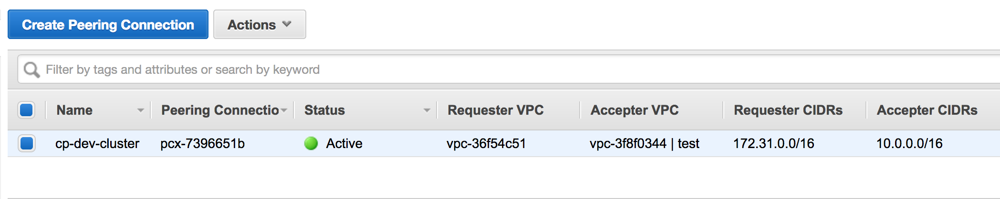

## Screenshots



*VPC Peering Connection in the AWS Web Console*


## Security & Compliance [](https://bridgecrew.io/)

Security scanning is graciously provided by Bridgecrew. Bridgecrew is the leading fully hosted, cloud-native solution providing continuous Terraform security and compliance.

| Benchmark | Description |
|--------|---------------|
| [](https://www.bridgecrew.cloud/link/badge?vcs=github&fullRepo=cloudposse%2Fterraform-aws-vpc-peering&benchmark=INFRASTRUCTURE+SECURITY) | Infrastructure Security Compliance |
| [](https://www.bridgecrew.cloud/link/badge?vcs=github&fullRepo=cloudposse%2Fterraform-aws-vpc-peering&benchmark=CIS+KUBERNETES+V1.5) | Center for Internet Security, KUBERNETES Compliance |
| [](https://www.bridgecrew.cloud/link/badge?vcs=github&fullRepo=cloudposse%2Fterraform-aws-vpc-peering&benchmark=CIS+AWS+V1.2) | Center for Internet Security, AWS Compliance |
| [](https://www.bridgecrew.cloud/link/badge?vcs=github&fullRepo=cloudposse%2Fterraform-aws-vpc-peering&benchmark=CIS+AZURE+V1.1) | Center for Internet Security, AZURE Compliance |
| [](https://www.bridgecrew.cloud/link/badge?vcs=github&fullRepo=cloudposse%2Fterraform-aws-vpc-peering&benchmark=PCI-DSS+V3.2) | Payment Card Industry Data Security Standards Compliance |
| [](https://www.bridgecrew.cloud/link/badge?vcs=github&fullRepo=cloudposse%2Fterraform-aws-vpc-peering&benchmark=NIST-800-53) | National Institute of Standards and Technology Compliance |
| [](https://www.bridgecrew.cloud/link/badge?vcs=github&fullRepo=cloudposse%2Fterraform-aws-vpc-peering&benchmark=ISO27001) | Information Security Management System, ISO/IEC 27001 Compliance |
| [](https://www.bridgecrew.cloud/link/badge?vcs=github&fullRepo=cloudposse%2Fterraform-aws-vpc-peering&benchmark=SOC2)| Service Organization Control 2 Compliance |
| [](https://www.bridgecrew.cloud/link/badge?vcs=github&fullRepo=cloudposse%2Fterraform-aws-vpc-peering&benchmark=CIS+GCP+V1.1) | Center for Internet Security, GCP Compliance |
| [](https://www.bridgecrew.cloud/link/badge?vcs=github&fullRepo=cloudposse%2Fterraform-aws-vpc-peering&benchmark=HIPAA) | Health Insurance Portability and Accountability Compliance |


## Usage


**IMPORTANT:** We do not pin modules to versions in our examples because of the
difficulty of keeping the versions in the documentation in sync with the latest released versions.
We highly recommend that in your code you pin the version to the exact version you are
using so that your infrastructure remains stable, and update versions in a
systematic way so that they do not catch you by surprise.

Also, because of a bug in the Terraform registry ([hashicorp/terraform#21417](https://github.com/hashicorp/terraform/issues/21417)),
the registry shows many of our inputs as required when in fact they are optional.
The table below correctly indicates which inputs are required.


For a complete example, see [examples/complete](examples/complete).

For Complete Execution of the Code the Code need to be Applied Twice as in order to firstly create the VPC and Subnets along with the Routes, and secondaly to merge the Routes of both the VPC`s.
In order to achive so the first Apply need to be run with the ["aws_route" "requestor"]["aws_route" "acceptor"] resources commented out, and the seconf apply with these resources.


For automated tests of the complete example using [bats](https://github.com/bats-core/bats-core) and [Terratest](https://github.com/gruntwork-io/terratest) (which tests and deploys the example on AWS), see [test](test).

### Using VPC IDs

```hcl
module "vpc_peering" {
  source = "cloudposse/vpc-peering/aws"
  # Cloud Posse recommends pinning every module to a specific version
  # version = "x.x.x"
  namespace        = "eg"
  stage            = "dev"
  name             = "cluster"
  requestor_vpc_id = "vpc-XXXXXXXX"
  acceptor_vpc_id  = "vpc-YYYYYYYY"
}
```

### Using VPC tags

```hcl
module "vpc_peering" {
  source = "cloudposse/vpc-peering/aws"
  # Cloud Posse recommends pinning every module to a specific version
  # version = "x.x.x"
  namespace          = "eg"
  stage              = "dev"
  name               = "cluster"
  requestor_vpc_tags = {
    "kubernetes.io/cluster/my-k8s" = "owned"
  }
  acceptor_vpc_tags  = {
    Name = "legacy-vpc"
  }
}
```

## Requirements

| Name | Version |
|------|---------|
| <a name="requirement_terraform"></a> [terraform](#requirement\_terraform) | >= 0.13.0 |
| <a name="requirement_aws"></a> [aws](#requirement\_aws) | >= 2.0 |
| <a name="requirement_local"></a> [local](#requirement\_local) | >= 1.3 |

## Providers

| Name | Version |
|------|---------|
| <a name="provider_aws"></a> [aws](#provider\_aws) | >= 2.0 |

## Modules

| Name | Source | Version |
|------|--------|---------|
| <a name="module_this"></a> [this](#module\_this) | cloudposse/label/null | 0.25.0 |

## Resources

| Name | Type |
|------|------|
| [aws_route.acceptor](https://registry.terraform.io/providers/hashicorp/aws/latest/docs/resources/route) | resource |
| [aws_route.requestor](https://registry.terraform.io/providers/hashicorp/aws/latest/docs/resources/route) | resource |
| [aws_vpc_peering_connection.default](https://registry.terraform.io/providers/hashicorp/aws/latest/docs/resources/vpc_peering_connection) | resource |
| [aws_route_tables.acceptor](https://registry.terraform.io/providers/hashicorp/aws/latest/docs/data-sources/route_tables) | data source |
| [aws_route_tables.requestor](https://registry.terraform.io/providers/hashicorp/aws/latest/docs/data-sources/route_tables) | data source |
| [aws_vpc.acceptor](https://registry.terraform.io/providers/hashicorp/aws/latest/docs/data-sources/vpc) | data source |
| [aws_vpc.requestor](https://registry.terraform.io/providers/hashicorp/aws/latest/docs/data-sources/vpc) | data source |

## Inputs

| Name | Description | Type | Default | Required |
|------|-------------|------|---------|:--------:|
| <a name="input_acceptor_allow_remote_vpc_dns_resolution"></a> [acceptor\_allow\_remote\_vpc\_dns\_resolution](#input\_acceptor\_allow\_remote\_vpc\_dns\_resolution) | Allow acceptor VPC to resolve public DNS hostnames to private IP addresses when queried from instances in the requestor VPC | `bool` | `true` | no |
| <a name="input_acceptor_ignore_cidrs"></a> [acceptor\_ignore\_cidrs](#input\_acceptor\_ignore\_cidrs) | A list of CIDR blocks from the acceptor VPC to ignore | `list(string)` | `[]` | no |
| <a name="input_acceptor_route_table_tags"></a> [acceptor\_route\_table\_tags](#input\_acceptor\_route\_table\_tags) | Only add peer routes to acceptor VPC route tables matching these tags | `map(string)` | `{}` | no |
| <a name="input_acceptor_vpc_id"></a> [acceptor\_vpc\_id](#input\_acceptor\_vpc\_id) | Acceptor VPC ID | `string` | `""` | no |
| <a name="input_acceptor_vpc_tags"></a> [acceptor\_vpc\_tags](#input\_acceptor\_vpc\_tags) | Acceptor VPC tags | `map(string)` | `{}` | no |
| <a name="input_additional_tag_map"></a> [additional\_tag\_map](#input\_additional\_tag\_map) | Additional key-value pairs to add to each map in `tags_as_list_of_maps`. Not added to `tags` or `id`.<br>This is for some rare cases where resources want additional configuration of tags<br>and therefore take a list of maps with tag key, value, and additional configuration. | `map(string)` | `{}` | no |
| <a name="input_attributes"></a> [attributes](#input\_attributes) | ID element. Additional attributes (e.g. `workers` or `cluster`) to add to `id`,<br>in the order they appear in the list. New attributes are appended to the<br>end of the list. The elements of the list are joined by the `delimiter`<br>and treated as a single ID element. | `list(string)` | `[]` | no |
| <a name="input_auto_accept"></a> [auto\_accept](#input\_auto\_accept) | Automatically accept the peering (both VPCs need to be in the same AWS account) | `bool` | `true` | no |
| <a name="input_context"></a> [context](#input\_context) | Single object for setting entire context at once.<br>See description of individual variables for details.<br>Leave string and numeric variables as `null` to use default value.<br>Individual variable settings (non-null) override settings in context object,<br>except for attributes, tags, and additional\_tag\_map, which are merged. | `any` | <pre>{<br>  "additional_tag_map": {},<br>  "attributes": [],<br>  "delimiter": null,<br>  "descriptor_formats": {},<br>  "enabled": true,<br>  "environment": null,<br>  "id_length_limit": null,<br>  "label_key_case": null,<br>  "label_order": [],<br>  "label_value_case": null,<br>  "labels_as_tags": [<br>    "unset"<br>  ],<br>  "name": null,<br>  "namespace": null,<br>  "regex_replace_chars": null,<br>  "stage": null,<br>  "tags": {},<br>  "tenant": null<br>}</pre> | no |
| <a name="input_create_timeout"></a> [create\_timeout](#input\_create\_timeout) | VPC peering connection create timeout. For more details, see https://www.terraform.io/docs/configuration/resources.html#operation-timeouts | `string` | `"3m"` | no |
| <a name="input_delete_timeout"></a> [delete\_timeout](#input\_delete\_timeout) | VPC peering connection delete timeout. For more details, see https://www.terraform.io/docs/configuration/resources.html#operation-timeouts | `string` | `"5m"` | no |
| <a name="input_delimiter"></a> [delimiter](#input\_delimiter) | Delimiter to be used between ID elements.<br>Defaults to `-` (hyphen). Set to `""` to use no delimiter at all. | `string` | `null` | no |
| <a name="input_descriptor_formats"></a> [descriptor\_formats](#input\_descriptor\_formats) | Describe additional descriptors to be output in the `descriptors` output map.<br>Map of maps. Keys are names of descriptors. Values are maps of the form<br>`{<br>   format = string<br>   labels = list(string)<br>}`<br>(Type is `any` so the map values can later be enhanced to provide additional options.)<br>`format` is a Terraform format string to be passed to the `format()` function.<br>`labels` is a list of labels, in order, to pass to `format()` function.<br>Label values will be normalized before being passed to `format()` so they will be<br>identical to how they appear in `id`.<br>Default is `{}` (`descriptors` output will be empty). | `any` | `{}` | no |
| <a name="input_enabled"></a> [enabled](#input\_enabled) | Set to false to prevent the module from creating any resources | `bool` | `null` | no |
| <a name="input_environment"></a> [environment](#input\_environment) | ID element. Usually used for region e.g. 'uw2', 'us-west-2', OR role 'prod', 'staging', 'dev', 'UAT' | `string` | `null` | no |
| <a name="input_id_length_limit"></a> [id\_length\_limit](#input\_id\_length\_limit) | Limit `id` to this many characters (minimum 6).<br>Set to `0` for unlimited length.<br>Set to `null` for keep the existing setting, which defaults to `0`.<br>Does not affect `id_full`. | `number` | `null` | no |
| <a name="input_label_key_case"></a> [label\_key\_case](#input\_label\_key\_case) | Controls the letter case of the `tags` keys (label names) for tags generated by this module.<br>Does not affect keys of tags passed in via the `tags` input.<br>Possible values: `lower`, `title`, `upper`.<br>Default value: `title`. | `string` | `null` | no |
| <a name="input_label_order"></a> [label\_order](#input\_label\_order) | The order in which the labels (ID elements) appear in the `id`.<br>Defaults to ["namespace", "environment", "stage", "name", "attributes"].<br>You can omit any of the 6 labels ("tenant" is the 6th), but at least one must be present. | `list(string)` | `null` | no |
| <a name="input_label_value_case"></a> [label\_value\_case](#input\_label\_value\_case) | Controls the letter case of ID elements (labels) as included in `id`,<br>set as tag values, and output by this module individually.<br>Does not affect values of tags passed in via the `tags` input.<br>Possible values: `lower`, `title`, `upper` and `none` (no transformation).<br>Set this to `title` and set `delimiter` to `""` to yield Pascal Case IDs.<br>Default value: `lower`. | `string` | `null` | no |
| <a name="input_labels_as_tags"></a> [labels\_as\_tags](#input\_labels\_as\_tags) | Set of labels (ID elements) to include as tags in the `tags` output.<br>Default is to include all labels.<br>Tags with empty values will not be included in the `tags` output.<br>Set to `[]` to suppress all generated tags.<br>**Notes:**<br>  The value of the `name` tag, if included, will be the `id`, not the `name`.<br>  Unlike other `null-label` inputs, the initial setting of `labels_as_tags` cannot be<br>  changed in later chained modules. Attempts to change it will be silently ignored. | `set(string)` | <pre>[<br>  "default"<br>]</pre> | no |
| <a name="input_name"></a> [name](#input\_name) | ID element. Usually the component or solution name, e.g. 'app' or 'jenkins'.<br>This is the only ID element not also included as a `tag`.<br>The "name" tag is set to the full `id` string. There is no tag with the value of the `name` input. | `string` | `null` | no |
| <a name="input_namespace"></a> [namespace](#input\_namespace) | ID element. Usually an abbreviation of your organization name, e.g. 'eg' or 'cp', to help ensure generated IDs are globally unique | `string` | `null` | no |
| <a name="input_regex_replace_chars"></a> [regex\_replace\_chars](#input\_regex\_replace\_chars) | Terraform regular expression (regex) string.<br>Characters matching the regex will be removed from the ID elements.<br>If not set, `"/[^a-zA-Z0-9-]/"` is used to remove all characters other than hyphens, letters and digits. | `string` | `null` | no |
| <a name="input_requestor_allow_remote_vpc_dns_resolution"></a> [requestor\_allow\_remote\_vpc\_dns\_resolution](#input\_requestor\_allow\_remote\_vpc\_dns\_resolution) | Allow requestor VPC to resolve public DNS hostnames to private IP addresses when queried from instances in the acceptor VPC | `bool` | `true` | no |
| <a name="input_requestor_ignore_cidrs"></a> [requestor\_ignore\_cidrs](#input\_requestor\_ignore\_cidrs) | A list of CIDR blocks from the requestor VPC to ignore | `list(string)` | `[]` | no |
| <a name="input_requestor_route_table_tags"></a> [requestor\_route\_table\_tags](#input\_requestor\_route\_table\_tags) | Only add peer routes to requestor VPC route tables matching these tags | `map(string)` | `{}` | no |
| <a name="input_requestor_vpc_id"></a> [requestor\_vpc\_id](#input\_requestor\_vpc\_id) | Requestor VPC ID | `string` | `""` | no |
| <a name="input_requestor_vpc_tags"></a> [requestor\_vpc\_tags](#input\_requestor\_vpc\_tags) | Requestor VPC tags | `map(string)` | `{}` | no |
| <a name="input_stage"></a> [stage](#input\_stage) | ID element. Usually used to indicate role, e.g. 'prod', 'staging', 'source', 'build', 'test', 'deploy', 'release' | `string` | `null` | no |
| <a name="input_tags"></a> [tags](#input\_tags) | Additional tags (e.g. `{'BusinessUnit': 'XYZ'}`).<br>Neither the tag keys nor the tag values will be modified by this module. | `map(string)` | `{}` | no |
| <a name="input_tenant"></a> [tenant](#input\_tenant) | ID element \_(Rarely used, not included by default)\_. A customer identifier, indicating who this instance of a resource is for | `string` | `null` | no |
| <a name="input_update_timeout"></a> [update\_timeout](#input\_update\_timeout) | VPC peering connection update timeout. For more details, see https://www.terraform.io/docs/configuration/resources.html#operation-timeouts | `string` | `"3m"` | no |

## Outputs

| Name | Description |
|------|-------------|
| <a name="output_accept_status"></a> [accept\_status](#output\_accept\_status) | The status of the VPC peering connection request |
| <a name="output_connection_id"></a> [connection\_id](#output\_connection\_id) | VPC peering connection ID |
